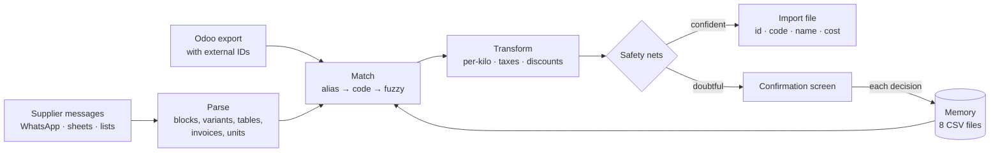

# Odoo cost updater

*Ships to end users as **Cost-oo**; this README covers the engine behind it.*

**Your suppliers send prices over WhatsApp, and someone types them into Odoo by hand.**

A buying club with ~500 products and ~140 small suppliers updates costs every month. Prices
arrive as chat messages, spreadsheets, PDFs, pasted tables, screenshots of the supplier's
invoicing system and multi-page wholesale lists. Nobody sends a clean CSV. Doing it by hand
takes hours, and the mistakes are silent: a wrong cost breaks nothing, you just sell at a lower
margin than you think for a whole month.

This app reads those messages, matches every line against the Odoo catalog, asks a human only
about the doubtful ones, and produces a file ready to import. In the last real cycle it processed
**178 lines from 30 suppliers in 6 different message formats**. It reproduced the costs already
in Odoo with zero matching errors.



## What it looks like

Input: the messages as the supplier sent them (examples stay in Spanish, which also shows the
matching copes with accents, slang and abbreviations):

```
Panadería La Espiga
Budines $3520 (5280)
    Limón
    Chocolate

La Quesera
Cremoso x 500 $7040
Sin quesos azules

Miel del Monte
Miel en frascos de vidrio.
360 cm3 (1/2 kilo) $5225
Pedidos: 3415550000

Embutidos La Sierra
LISTA - precios por kilo
BONDIOLA FET $23467

Limpieza Clara
02  1002 CLARA. DETERGENTE 750 CC      12   1711.11  10.00  18480.00
```

Output:

| Line | Odoo product | Cost | Why |
|---|---|---|---|
| Budines → Limón / Chocolate | Budín de limón 350 g, Budín de chocolate 350 g | 3520 each | variants inherit the header price; `(5280)` is the suggested retail price, not the cost |
| Cremoso x 500 | Queso cremoso 500 g - Lácteos Don Julio | 7040 | "La Quesera" is a known nickname of the supplier |
| Sin quesos azules | Queso azul 200 g | – | out-of-stock warning, never auto-unpublished |
| 360 cm3 (1/2 kilo) | Miel 500 g | 5225 | the untitled price line inherits "Miel en frascos de vidrio"; the phone number is not a product |
| BONDIOLA FET | Bondiola feteada 150 g | 3520 | quoted per kilo: 23467 × 0.150 |
| DETERGENTE 750 CC | Detergente 750 cc | 1540 | invoice line: amount / quantity (18480 / 12), discount included |

All of it is a fictional store that ships with the repo (see *Try it* below).

## Try it

The repo ships a fictional store in [`ejemplo/`](ejemplo): an Odoo export, a sheet of supplier
messages, a PDF price list with discounts and a brand only in its title, and an Excel list with mixed
VAT rates and a per-case price. New prices are +10%, as if it were the next cycle.

On Windows, double-click **`Probar con el ejemplo.bat`** and press *Cargar el ejemplo y analizar*.
It runs on its own port with its own data folder, so it never touches a real business. The first
cycle resolves 15 costs on its own and asks about 17. Answer them, run it again, and all 31 go in
by themselves. [`tests/test_ejemplo.py`](tests/test_ejemplo.py) walks through that same tour.

## Running it

Windows, for non-technical users: double-click **`Abrir actualizador.bat`**. The first run
creates a virtual environment and installs the dependencies, then the app opens in the browser
with a short setup (business name, suppliers, optional Google Sheet). The operator guide is
[`LEEME - como usar.md`](LEEME%20-%20como%20usar.md) (Spanish).

Anywhere else:

```bash
pip install -r requirements.txt
python -m web.app          # http://127.0.0.1:8765
python -m pytest tests     # the test suite
```

Business data (learned memory, current cycle, generated files) lives in `datos/`, which is git-ignored.
Environment variables: `ACTUALIZADOR_DATOS` (data folder), `ACTUALIZADOR_PUERTO` (port).

**What is generic and what belongs to each business.** The code knows Argentine Spanish and the
usual abbreviations of distributor lists (`c/`, `s/`, `choris`, `merme`, 30-character truncations).
Each business's own jargon (a distributor that truncates a brand, a producer's nickname for a
product) lives in its memory (`abreviaturas.csv`), as do the rows of its Odoo export that are not
products (`no_son_productos.csv`). Tax rules (VAT 21% / 10.5%, perception) are isolated in
[`core/pais.py`](core/pais.py).

## Layout

```
core/           the engine, no UI dependencies
  catalog.py      normalizes the Odoo export
  normalize.py    units, abbreviations, plurals
  parse.py        message structures → lines; message fingerprints
  pricelist.py    distributor price lists: PDF (one or two columns), Excel, CSV, photos
  ocr.py          reads a photographed or scanned price list (RapidOCR)
  sheets.py       reads the tracking sheet straight from Google Sheets
  providers.py    supplier names, brands and nicknames
  match.py        alias → code → fuzzy; distributor lists
  transform.py    per-kilo, taxes, per-case prices
  pais.py         country tax rules (Argentina)
  output.py       classification, safety nets, final review, import file
  verify.py       post-import check against a fresh export
  memory.py       the memory CSVs, cost history, processed messages
  cycle.py        one full cycle over several sources
web/            local Flask UI (setup, sources, confirm, review, download, verify, practice mode)
ejemplo/        a fictional store to try the app (regenerate with ejemplo/_generar.py)
tests/          one test per real bug, the example tour, plus regression on real data when present
```

## Sources, provenance and the post-import check

A cycle combines any number of sources: the tracking sheet (read directly from Google Sheets),
one-off messages with the supplier picked by hand, and distributor price lists in PDF or Excel.

- **Messages already processed are skipped.** Each message is fingerprinted. If a supplier's row in
  the sheet still holds last month's text, those prices are already in Odoo.
- **Distributor lists are code-driven.** A 1,250-item PDF from a distributor asks about the ~12 items
  that resemble something in the catalog and hides the rest. Once an item is confirmed, its
  distributor code is learned and it matches automatically from then on.
- **Every cost carries its provenance:** supplier, message or list, distributor code. It's shown in
  every table and written to a cost history. The latest source per product is "who we buy it from".
  If a different supplier or distributor quotes that product (the same canned tuna is sold by
  several distributors), the app asks before using that price.
- **Final review, then verification.** Before import, everything that will change is listed with
  the odd cases first (big changes, cost above sale price, thin margin). After import, a fresh Odoo
  export is compared line by line. It checks that each cost actually landed and that the product
  count didn't grow, since duplicates are the signature of a bad import.

## Lessons that are now tests

- **The external ID rule.** The import must carry Odoo's external ID
  (`__export__.product_template_...`) in the `id` column, or Odoo *creates* products instead of
  updating them. The original prototype looked for the ID column by substring. `"id"` is inside
  `"cant**id**ad a la mano"` (quantity on hand), so it took stock quantities as IDs and Odoo created
  15 duplicate products. Now the column is matched by exact name only, and every ID is
  validated before any file is written.
- **Aliases are scoped to their supplier.** Unscoped, one supplier's "Prepizzas" alias put $5,700
  on another supplier's $2,100 product.
- **`token_set_ratio` says 100 when one text is a subset of another.** "c/miel" swallowed
  "c/miel y cacao". A `token_sort_ratio >= 85` floor over the full text fixes it, tried with and
  without a leading purchase quantity ("15 canelones" vs the alias "canelones").
- **Units:** `1/2 kg` is 500 g (not 2 kg). `x 12` is 12 units, `x 500` is 500 g. `24x300g` is a
  case of 24, keep the 300 g. `(12 UxB)` describes the box, not the product.
- **Invoice lines:** the real cost is amount / quantity, not the list unit price.
- **The same product never enters the import twice.** Odoo would silently apply the last one.
- **A different pack size stops the cost.** "25 g vs 50 g" may be new packaging. "200 g vs 360 g" is
  another product. Only approved changes go through.

## Roadmap

- **v2:** Odoo XML-RPC adapter to read the catalog and write costs directly (files stay the default).
- **v3:** new-product creation, alerts against the historical average (the cost history is
  already being recorded).

See [`CHANGELOG.md`](CHANGELOG.md) for the story of how it got here, bug by bug.
